<h1 align="center">Scott Reed</h1>
<h3 align="center">🧪 Chemist • 👨‍🏫 Teacher • 🧠 AI engineer • ✨ Open sourcerer</h3>

  <em>I teach scientists about AI and I teach AI about science.</em>

  

  <a href="https://chemillusion.com">ChemIllusion Founder</a> •
  <a href="https://clas.ucdenver.edu/scott-reed/research-overview">CU Denver faculty</a> •
  <a href="https://scholar.google.com/citations?hl=en&user=f3CHyKEAAAAJ">Google Scholar</a> •
  <a href="https://www.linkedin.com/in/scott-reed-76430499/">LinkedIn</a> •
  <a href="https://github.com/scottmreed?tab=repositories">Repositories</a>

  

## Story at a glance

<table>
  <tr>
    <td><b>ChemIllusion</b></td>
    <td>Chemistry-native AI for artistic scientific figures, molecule-aware workflows, and education—structures first, creativity second. Try the <a href="https://chemillusion.com/generator?drawingCoachLesson=tool-single-bond">drawing coach</a>.</td>
  </tr>
  <tr>
    <td><b>Open source</b></td>
    <td>RDKit WASM tooling, MCP apps (including the <a href="https://chemillusion.com/mcp-server">ChemIllusion MCP server</a>), and small libraries other builders can adopt without the whole product stack.</td>
  </tr>
  <tr>
    <td><b>Research + teaching</b></td>
    <td>Synthesis to nanoscience, pharmacogenomics, green chemistry, and AI in chemistry—including work on <a href="https://doi.org/10.26434/chemrxiv-2025-rwgt8">reducing chemical hallucinations in LLM workflows</a>.</td>
  </tr>
</table>

## Featured repositories

| | |
| --- | --- |
| **[ChemCP](https://github.com/scottmreed/ChemCP)** | MCP App: interactive 2D structures from SMILES with RDKit.js—built for assistants that should *show* chemistry, not guess it. |
| **[rdkit-agent](https://github.com/scottmreed/rdkit-agent)** ([npm](https://www.npmjs.com/package/rdkit-agent)) | Agent-first cheminformatics CLI (Node + RDKit WASM): validate, convert, descriptors, SMARTS, reactions—JSON in, JSON out. |
| **[professor-wiggum](https://github.com/scottmreed/professor-wiggum)** | Mechanistic curriculum + chemistry/AI harness experiments, skills, and reproducible training lanes. |
| **[llm-smarts-arena](https://github.com/scottmreed/llm-smarts-arena)** | Public benchmark for LLM reasoning on SMILES, SMARTS, and SMIRKS—tokenization-sensitive chemistry string tasks. |
| **[chemistry-augmented-generation](https://github.com/scottmreed/chemistry-augmented-generation)** | Code and pipelines behind augmented/programmatic LLM prompts for molecular property-style tasks (e.g. TPSA) with RAG + DSPy. |
| **[chem-tetris](https://github.com/scottmreed/chem-tetris)** | **IUPAC Rain**—Discord Activity: ASCII “tetris” with C/O pieces and molecule targets; playful chemistry where people already hang out. |

## Tools I reach for

  
  
  
  
  

## Why this profile exists

I build at the intersection of **chemistry, code, and AI**.

Some of that ships as **ChemIllusion**—product-grade workflows for people who live in structures and spectra.

A lot of it returns to the community as **FOSS**—editors, benchmarks, MCP pieces, and RDKit-first utilities—because good science needs shared ground truth.

If that sounds like your lab or your engineering team, you will probably like the repositories above more than this README.
